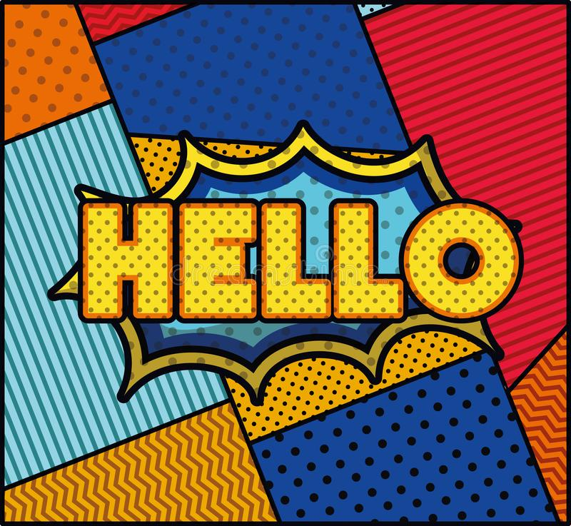

# Michelle's User Page 

## About Me

Hello! I am a second year Math-CS student. I am originally from New York, born and raised in NYC. I moved to Florida a few years before attending UCSD. Here's a picture of the beautiful [beach](JupiterBeach.jpg). I enjoy trying new recipes during my free time, listening to music and viewing movies with my friends. Currently, one of my favorite song/instrumental is [Daylight](https://www.youtube.com/watch?v=ALY5vV-BlSY). Some other instrumentals I would play on repeat: 
-  Ludovico Einaudi: Experience 
-  Yumeiji's Theme: In The Mood For Love 
-  MoreanP : Ephemeral Memories
  
Next Section ->[Me as a Programmer](#me-as-a-programmer)

## Me as a Programmer
>I am **super excited** for the course!!!

I do not have much experience with programming other than the experiences I gained from my courses. So I am eager to find out more of who I would be as a programmer. I am also looking to have more programming experiences outside from class, such as working on side projects. Some of my goals for this class are:

- [ ] Understand who is a Software Engineer
- [ ] Collaborate with my peers and learn different perspectives
- [ ] Enjoy the course

Random funfact my favorite terminal command is `clear`, it's just satisfying using this command. 
